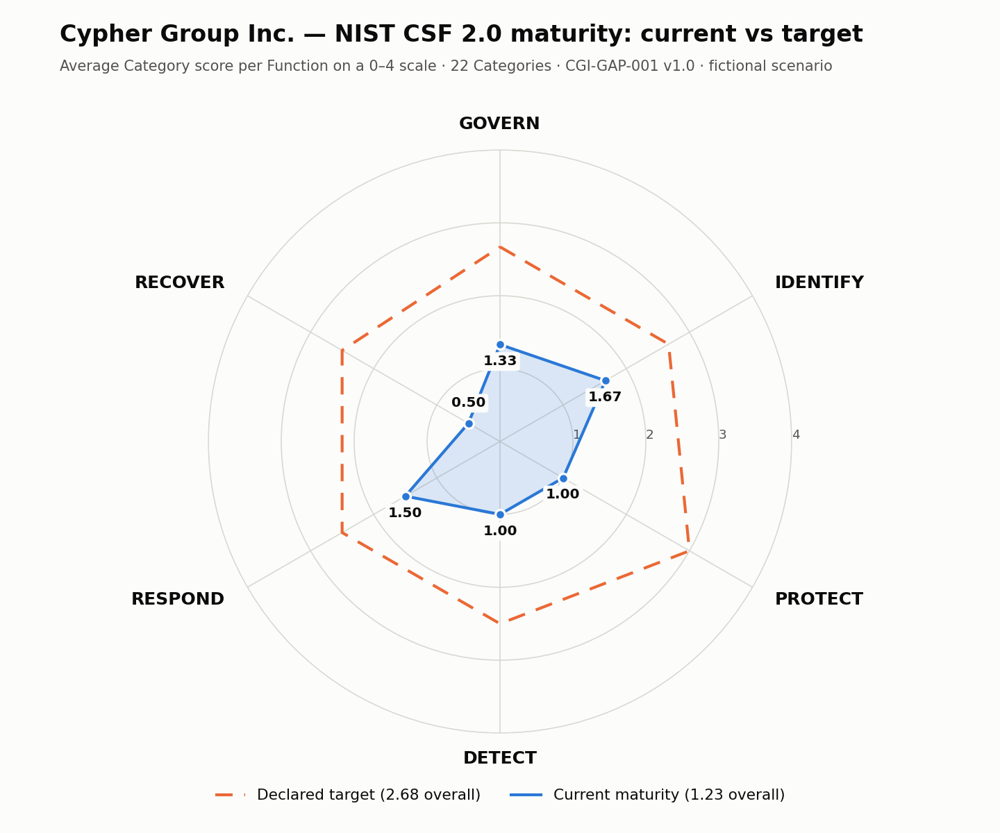
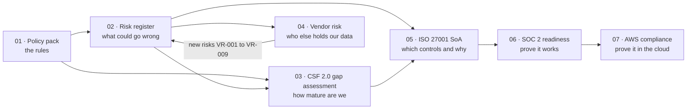

  

  <b>A complete information security governance programme, built project by project for one fictional 50-person SaaS company.</b> 
  Policies → risk → maturity → vendors → ISO 27001 → SOC 2 → cloud compliance.

  <a href="https://www.linkedin.com/in/YOUR-PROFILE">LinkedIn</a> ·
  <a href="https://YOUR-SITE.notion.site">Notion portfolio</a> ·
  <a href="https://medium.com/@YOUR-HANDLE">Medium</a> ·
  <a href="https://YOUR-HANDLE.substack.com">Substack</a> ·
  <a href="templates/">Free templates</a>

  
  
  
  
  
  

---

## Start here — a 2-minute tour

> [!TIP]
> **Short on time?** Start with any of these:
> 1. **[Project 01](01-security-policy-pack/)** — the AI-tools clause (§4.5) and the phishing-resistant MFA rule (§4.3.3) in the policy pack.
> 2. **[Project 02](02-risk-register/)** — why two of five risks are deliberately left **High** after treatment, and what it would cost to fix them.
> 3. **[Project 04](04-vendor-risk-management/)** — how AI tools bought on expenses were discovered and brought under control, and why AWS passed only with conditions that were all *ours*.
> 4. **[Project 05](05-iso27001-readiness-soa/)** — why none of 88 applicable ISO 27001 controls is marked *Implemented*, and why that is the honest answer.
> 5. **[Templates](templates/)** — the same documents as blank, reusable templates you can download.

## Projects

| # | Project | What it demonstrates | Headline result | Status |
|:-:|---|---|---|:-:|
| 01 | **[Startup Security Policy Pack](01-security-policy-pack/)** | Policy writing · framework mapping · policy governance | 5 policies · 38 ISO 27001 Annex A controls mapped · exception register · sign-off tracker | ✅ Published |
| 02 | **[Master Information Security Risk Register](02-risk-register/)** | NIST SP 800-30 risk assessment · control mapping · treatment planning | 5 risks · aggregate exposure 92 → 44 (−52%) · 10 treatment actions · 7 KRIs | ✅ Published |
| 03 | **[NIST CSF 2.0 Gap Assessment & Maturity Scorecard](03-nist-csf-gap-assessment/)** | Maturity scoring · gap analysis · roadmap | All 22 CSF Categories · maturity 1.23 → target 2.68 · 18 recommendations | ✅ Published |
| 04 | **[Third-Party / Vendor Risk Management Programme](04-vendor-risk-management/)** | Vendor tiering · questionnaires · contract controls · AI vendor risk | 17 vendors tiered · 74-question questionnaire · 3 assessments · GV.SC 0 → 2 | ✅ Published |
| 05 | **[ISO/IEC 27001:2022 Readiness & Statement of Applicability](05-iso27001-readiness-soa/)** | ISMS scoping · Statement of Applicability · certification readiness | 93 controls: 88 applicable, 0 / 45 / 43 · readiness 30.6%, Stage 1 NO-GO · realistic certificate Nov 2027 | ✅ Published |
| 06 | SOC 2 Type II Readiness & Internal Audit Workpapers | Control testing · evidence · sampling | — | ⏳ Next |
| 07 | AWS Cloud Compliance (CIS Benchmark) | Cloud configuration review · control mapping | — | 🗓️ Planned |

 Project 03: where the company stands against NIST CSF 2.0, and where it has decided to be

## How the projects connect

Every project builds on the one before it, the way a real GRC programme does.

## The scenario — Cypher Group Inc. *(fictional)*

| | |
|---|---|
| **Company** | 50-person B2B SaaS, project-management platform, ~200 SMB customers |
| **Stack** | AWS · GitHub · Slack · Google Workspace · Stripe (payment metadata only) |
| **Starting point** | No formal GRC programme. Three enterprise deals stuck at security review. |
| **The job** | Build the programme that gets those deals through — and survives an audit. |

## Free templates

Blank, reusable versions of the documents in this portfolio. Download, replace the `[BRACKETED]` fields, and use them.

| Template | Formats |
|---|---|
| Acceptable Use Policy | [Word](templates/acceptable-use-policy-template.docx) · [Markdown](templates/acceptable-use-policy-template.md) |
| Policy Sign-off & Training Tracker | [Excel](templates/policy-signoff-tracker-template.xlsx) · [CSV](templates/policy-signoff-tracker-template.csv) |
| Information Security Risk Register (NIST SP 800-30, 5 × 5) | [Word](templates/risk-register-template.docx) · [Markdown](templates/risk-register-template.md) · [CSV](templates/risk-register-template.csv) |
| NIST CSF 2.0 Gap Assessment | [Word](templates/nist-csf-gap-assessment-template.docx) · [Markdown](templates/nist-csf-gap-assessment-template.md) · [CSV](templates/nist-csf-gap-assessment-template.csv) |
| Vendor Security Questionnaire (74 questions, automatic scoring) | [Excel](templates/vendor-risk-questionnaire-template.xlsx) · [Markdown](templates/vendor-risk-questionnaire-template.md) · [CSV](templates/vendor-risk-questionnaire-template.csv) |
| Vendor Inventory & Tiering Register | [Markdown](templates/vendor-risk-inventory-template.md) · [CSV](templates/vendor-risk-inventory-template.csv) |
| Vendor Security Assessment Report | [Word](templates/vendor-risk-assessment-report-template.docx) · [Markdown](templates/vendor-risk-assessment-report-template.md) · [Findings CSV](templates/vendor-risk-assessment-findings-template.csv) |
| ISO/IEC 27001:2022 Statement of Applicability (93 controls, automatic status and readiness score) | [Excel](templates/iso27001-soa-template.xlsx) · [Markdown](templates/iso27001-soa-template.md) · [CSV](templates/iso27001-soa-template.csv) |
| ISO/IEC 27001:2022 Clauses 4–10 Readiness Assessment | [Word](templates/iso27001-readiness-assessment-template.docx) · [Markdown](templates/iso27001-readiness-assessment-template.md) · [CSV](templates/iso27001-readiness-assessment-template.csv) |

➡️ **[Browse all templates](templates/)** · or download everything at once from **[Releases](../../releases/latest)**.

## Skills demonstrated

| Area | Evidence |
|---|---|
| **Governance** | Policy hierarchy, document control, exception management, policy register — [01](01-security-policy-pack/) |
| **Risk management** | Anchored 5 × 5 scales, inherent vs residual scoring, all four treatment strategies, KRIs — [02](02-risk-register/), [04](04-vendor-risk-management/) |
| **Maturity assessment** | Declared target state, 0–4 evidence-based scoring, reconciliation with the risk register, prioritised roadmap — [03](03-nist-csf-gap-assessment/) |
| **Third-party risk** | Discovery from four sources, published tiering model, weighted questionnaire, SOC 2 report reading (including the controls it assumes the customer runs), contract clauses — [04](04-vendor-risk-management/) |
| **ISO/IEC 27001 and ISMS** | Scope statement, a 93-control Statement of Applicability traced to risks and findings, clauses 4–10 readiness with Stage 1 gates, costed certification roadmap — [05](05-iso27001-readiness-soa/) |
| **Compliance mapping** | ISO/IEC 27001:2022 Annex A, NIST CSF 2.0, SOC 2 TSC, GDPR Art. 28 — [01](01-security-policy-pack/), [03](03-nist-csf-gap-assessment/), [04](04-vendor-risk-management/), [05](05-iso27001-readiness-soa/) |
| **AI governance** | Approved-AI-tools policy ([01 §4.5](01-security-policy-pack/01-security-policy-pack.md#45-use-of-artificial-intelligence-tools)) · AI vendor tiering trigger, AI questionnaire domain and no-training contract clause ([04](04-vendor-risk-management/)) |
| **Audit readiness** | Evidence trackers, escalation rules, retention periods, documented-information checklist, go/no-go with a veto rule, honest limitation statements — [01](01-security-policy-pack/), [05](05-iso27001-readiness-soa/) |
| **Tooling** | Excel (formulas, validation, conditional formatting), Markdown, Notion, GitHub |

## About me

I am moving into Governance, Risk and Compliance from an analytical background (MSc Applied Economics). My focus is practical security governance for growing companies — with a particular interest in **AI governance**: how organisations let people use AI tools without leaking the data they are trusted with.

**Open to:** GRC Analyst · Information Security Analyst · IT Audit · Security Compliance roles — Germany / EU, UK and remote.
**Contact:** [LinkedIn](https://www.linkedin.com/in/YOUR-PROFILE)

---

**Fictional data notice.** Cypher Group Inc. and every person, record, date and finding in this repository are invented to demonstrate applied GRC capability. No real company or personal data is used, and no certification or attestation is claimed. Framework mappings are the author's own analysis. Templates are free to reuse under the licence in this repository.
